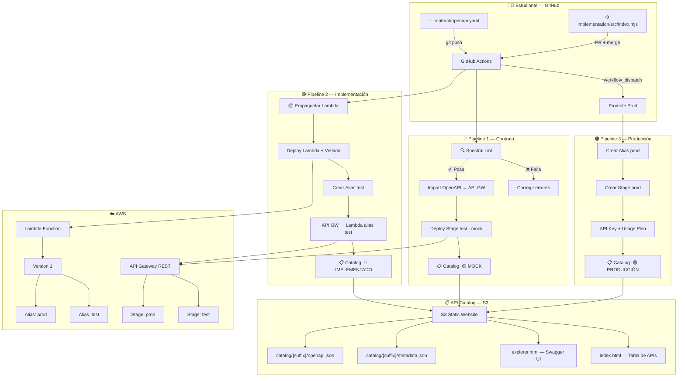
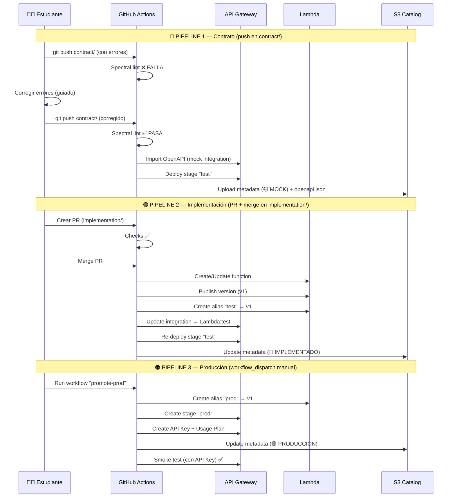

# 🧪 Laboratorio: Ciclo de Vida de una API — Del Linting al Catálogo

## 📋 Tabla de Contenidos

- [Objetivo y Alcance](#-objetivo-y-alcance)
- [Pre-requisitos](#-pre-requisitos)
- [Arquitectura](#-arquitectura)
- [Estructura del Repositorio](#-estructura-del-repositorio)
- [Laboratorio Guiado](#-laboratorio-guiado)
  - [Fase 0 — Setup Inicial](#fase-0--setup-inicial-8-min)
  - [Fase 1 — Pipeline del Contrato](#fase-1--pipeline-del-contrato-lint--mock-15-min)
  - [Fase 2 — Pipeline de Implementación](#fase-2--pipeline-de-implementación-lambda--test-15-min)
  - [Fase 3 — Promoción a Producción](#fase-3--promoción-a-producción-10-min)
  - [Fase 4 — Exploración del Catálogo](#fase-4--exploración-del-catálogo-9-min)
  - [Fase 5 — Limpieza](#fase-5--limpieza-5-min)
- [Laboratorio Propuesto](#-laboratorio-propuesto)

---

## 🎯 Objetivo y Alcance

### Objetivo

Implementar el **ciclo de vida completo de una API** con gobernanza automatizada, desde la validación del contrato OpenAPI hasta su publicación en un catálogo centralizado, utilizando **GitHub Actions** como motor de CI/CD y **AWS** como plataforma cloud.

### Al finalizar el laboratorio, serás capaz de:

1. ✅ Validar contratos OpenAPI contra estándares de gobernanza usando **Spectral** (linter)
2. ✅ Desplegar una API en modo **mock** en AWS API Gateway para pruebas tempranas
3. ✅ Implementar un **AWS Lambda** con versionado (versions + aliases) como backend real
4. ✅ Promover una API de **test → producción** de forma controlada
5. ✅ Proteger el endpoint de producción con **API Key + Usage Plan**
6. ✅ Publicar tu API en un **catálogo centralizado** con documentación interactiva (Swagger UI)
7. ✅ Entender cómo se automatiza la gobernanza de APIs en un pipeline CI/CD

### Alcance

| Incluido | 
|----------|
| API Gateway REST (mock + Lambda) |
| Lambda con versions y aliases |
| Linting con Spectral |
| Catálogo estático en S3 con Swagger UI |
| GitHub Actions (CI/CD) |
| Despliegue en AWS |
| API Key + Usage Plan |

### Contexto Multi-nube

Este laboratorio se despliega en **AWS**, pero la arquitectura del catálogo está diseñada para ser **multi-nube**. Cada API registrada en el catálogo incluye un campo `cloud` en sus metadatos que indica en qué proveedor está desplegada. En un futuro, se podrían agregar pipelines adicionales para desplegar APIs en **Azure** (API Management + Azure Functions) y **GCP** (Apigee + Cloud Functions), y todas se registrarían en el mismo catálogo centralizado.

---

## 📌 Pre-requisitos

### Para el Estudiante

| Requisito | Detalle |
|-----------|---------|
| **Cuenta GitHub** | Gratuita — [github.com](https://github.com) |
| **Cuenta AWS** | Proporcionada por el instructor (AWS Academy / Learner Lab) |
| **AWS Access Key** | `AWS_ACCESS_KEY_ID` y `AWS_SECRET_ACCESS_KEY` del lab |
| **Navegador web** | Chrome, Firefox o Edge (versión reciente) |
| **Suffix asignado** | Número del 01 al 35 (proporcionado por el instructor) |
| **URL del catálogo** | Proporcionada por el instructor |
| **Conocimientos previos** | Sesiones 1-3 del curso (APIs REST, OpenAPI, API Gateway) |

### Para el Instructor

| Requisito | Detalle |
|-----------|---------|
| **Cuenta AWS** | Con permisos de poweruser |
| **AWS CLI** | Configurado localmente |
| **Catálogo desplegado** | Ejecutar `api-catalog/deploy-catalog.sh` antes de la clase |
| **IAM Role Lambda** | Creado previamente (ver `api-catalog/README.md`) |

---

## 🏗️ Arquitectura

### Diagrama General



### Flujo de los 3 Pipelines



---

## 📂 Estructura del Repositorio

```
api-lifecycle-lab/
├── README.md                          ← 👨‍🎓 Este archivo (lab del estudiante)
├── .github/workflows/
│   ├── contract-pipeline.yml          ← 🔵 Lint + Mock
│   ├── implementation-pipeline.yml    ← 🟢 Lambda + Test
│   ├── promote-prod.yml               ← 🟠 Producción (manual)
│   └── cleanup.yml                    ← 🔴 Limpieza (manual)
├── contract/
│   ├── openapi.yaml                   ← OpenAPI con errores intencionales
│   └── .spectral.yml                  ← Reglas de gobernanza
├── implementation/
│   └── src/
│       └── index.mjs                  ← Lambda handler
├── scripts/
│   ├── 01-deploy-mock.sh
│   ├── 02-deploy-lambda-test.sh
│   ├── 03-update-api-integration.sh
│   ├── 04-promote-prod.sh
│   ├── 05-update-catalog.sh
│   └── 99-cleanup.sh
└── api-catalog/                       ← 👨‍🏫 Solo instructor
    ├── README.md
    ├── deploy-catalog.sh
    ├── destroy-catalog.sh
    ├── config.env
    ├── frontend/
    │   ├── index.html
    │   ├── explorer.html
    │   ├── assets/
    │   │   ├── style.css
    │   │   ├── catalog.js
    │   │   └── explorer.js
    │   └── swagger-ui/
    │       └── (descargar con deploy-catalog.sh)
    └── templates/
        ├── metadata-template.json
        └── manifest-template.json
```

---

## 🧪 Laboratorio Guiado

> **Tiempo total estimado: ~62 minutos**
>
> **API a implementar:** `GET /clientes/{clienteId}/cuentas` — Consultar cuentas bancarias de un cliente

---

### Fase 0 — Setup Inicial (8 min)

#### 0.1 — Fork del repositorio

1. Ve al repositorio del instructor en GitHub.
2. Haz clic en **Fork** (esquina superior derecha).
3. Selecciona tu cuenta personal como destino.
4. Espera a que se complete el fork.

#### 0.2 — Configurar GitHub Secrets y Variables

1. En **tu fork**, ve a **Settings → Secrets and variables → Actions**.
2. En la pestaña **Secrets**, crea los siguientes:

| Secret Name | Valor |
|-------------|-------|
| `AWS_ACCESS_KEY_ID` | (Utilizas credenciales del Access Portal de AWS) |
| `AWS_SECRET_ACCESS_KEY` | (Utilizas credenciales del Access Portal de AWS) |
| `AWS_SESSION_TOKEN` | (Utilizas credenciales del Access Portal de AWS) |
| `AWS_REGION` | `us-east-1` |
| `CATALOG_BUCKET` | `api-catalog-sesion4`  |
| `LAMBDA_ROLE_ARN` | `Copiar el ARN de lab-lambda-role en IAM > Roles` |

3. En la pestaña **Variables**, crea la siguiente:

| Variable Name | Valor |
|---------------|-------|
| `SUFFIX` | Tu número asignado (ej: `07`) |

#### 0.3 — Verificar el Badge en el README

El README ya incluye un badge de estado. Cambia `{TU_USUARIO}` por tu usuario de GitHub:

```markdown

```

---

### Fase 1 — Pipeline del Contrato: Lint + Mock (15 min)

#### 1.1 — Disparar el pipeline (con errores intencionales)

El archivo `contract/openapi.yaml` ya tiene **4 errores intencionales** de gobernanza. Para que GitHub Actions detecte el cambio y ejecute el pipeline, realiza un pequeño cambio estético en el archivo (ej: agrega un espacio al final o cambia la descripción en la línea 2) y haz push:

```bash
git add contract/openapi.yaml
git commit -m "chore: validar gobernanza del contrato"
git push origin main
```

> 💡 **Tip**: También puedes ir a la pestaña **Actions** en GitHub, seleccionar **"Contract Pipeline"** y hacer clic en **"Run workflow"** ya que se tiene activo el `workflow_dispatch`.

#### 1.2 — Verificar que el pipeline FALLA ❌

1. Ve a la pestaña **Actions** en tu repositorio.
2. Verás el workflow **"Contract Pipeline"** ejecutándose.
3. El job **"lint"** fallará ❌.
4. Haz clic en el job → expande el step **"Run Spectral Lint"**.

#### 1.3 — Revisar los errores en el log

Verás un output similar a:

```
contract/openapi.yaml
  3:12   error  api-version-non-empty            Info "version" must not be empty.
  14:3   error  paths-kebab-case                 Path "/getClienteCuentas/{clienteId}" must use kebab-case (/clientes/{clienteId}/cuentas).
  16:5   error  operation-id-required             Each operation must have an "operationId".
  20:9   error  response-description-required     Response "200" must have a "description".

✖ 4 problems (4 errors, 0 warnings, 0 infos)
```

#### 1.4 — Corregir los errores

Abre `contract/openapi.yaml` y aplica las siguientes correcciones:

| # | Error | Ubicación | Corrección |
|---|-------|-----------|------------|
| 1 | `version: ""` | Línea ~3, bloque `info:` | Cambiar a `version: "1.0.0"` |
| 2 | `/getClienteCuentas/{clienteId}` | Línea ~14, bloque `paths:` | Cambiar a `/clientes/{clienteId}/cuentas` |
| 3 | Falta `operationId` | Línea ~16, operación `get:` | Agregar `operationId: listarCuentasCliente` |
| 4 | Falta `description` en response 200 | Línea ~20, dentro de `responses:` | Agregar `description: "Lista de cuentas bancarias del cliente"` |

#### 1.5 — Hacer push (corregido)

```bash
git add contract/openapi.yaml
git commit -m "fix: corregir errores de gobernanza en openapi"
git push origin main
```

> ⏳ El Pipeline 1 se ejecuta nuevamente:
> 1. ✅ **Lint** — Spectral pasa sin errores
> 2. ✅ **Deploy Mock** — Crea API Gateway con integración mock + stage `test`
> 3. ✅ **Smoke Test** — Valida que el mock responde correctamente
> 4. ✅ **Update Catalog** — Sube metadata (🟡 MOCK) y openapi.json al S3

#### 1.6 — Verificar resultados

1. **GitHub Actions**: El workflow muestra todos los jobs en verde ✅.
2. **AWS Console → API Gateway**: Verás `cuentas-api-{suffix}` con stage `test`.
3. **Catálogo Web**: Abre la URL del catálogo → tu API aparece con badge **🟡 MOCK**.
4. **Probar el mock**:
   ```bash
   curl https://{api-id}.execute-api.us-east-1.amazonaws.com/test/clientes/CLI001/cuentas
   ```
   Respuesta mock:
   ```json
   {
     "statusCode": 200,
     "body": {
       "clienteId": "CLI001",
       "cuentas": [
         { "numeroCuenta": "1234567890", "tipo": "AHORROS", "saldo": 5000.00 }
       ]
     }
   }
   ```

---

### Fase 2 — Pipeline de Implementación: Lambda + Test (15 min)

#### 2.1 — Crear una rama

```bash
git checkout -b feature/implementation
```

#### 2.2 — Revisar y personalizar el código Lambda

Abre `implementation/src/index.mjs`. El código ya viene funcional. Personaliza los datos de ejemplo si deseas (ej. agregar tu nombre en el campo `titular`).

#### 2.3 — Hacer push y crear Pull Request

```bash
git add .
git commit -m "feat: implementar Lambda para GET /clientes/{clienteId}/cuentas"
git push origin feature/implementation
```

1. En GitHub, verás el banner **"Compare & pull request"** → clic.
2. Título: `feat: implementar endpoint cuentas`.
3. Clic en **"Create pull request"**.
4. Espera a que los **checks pasen** ✅ (el pipeline ejecuta validaciones).

#### 2.4 — Merge del Pull Request

1. Una vez que los checks pasen ✅, haz clic en **"Merge pull request"**.
2. Confirma el merge.

> ⏳ El Pipeline 2 se ejecuta automáticamente:
> 1. ✅ **Build** — Empaqueta el código Lambda en ZIP
> 2. ✅ **Deploy Lambda** — Crea/actualiza función + publica versión + crea alias `test`
> 3. ✅ **Update API GW** — Cambia integración de mock → Lambda alias `test`
> 4. ✅ **Smoke Test** — Valida respuesta real del Lambda
> 5. ✅ **Update Catalog** — Actualiza metadata a 🔵 IMPLEMENTADO

#### 2.5 — Verificar resultados

1. **AWS Console → Lambda**: Verás `cuentas-lambda-{suffix}` con versión 1 y alias `test`.
2. **AWS Console → API Gateway**: La integración ahora dice **Lambda Function** (ya no mock).
3. **Catálogo Web**: Tu API muestra badge **🔵 IMPLEMENTADO**.
4. **Probar la implementación real**:
   ```bash
   curl https://{api-id}.execute-api.us-east-1.amazonaws.com/test/clientes/CLI001/cuentas
   ```
   Ahora devuelve datos reales del Lambda (no mock).

---

### Fase 3 — Promoción a Producción (10 min)

#### 3.1 — Ejecutar pipeline manualmente

1. Ve a **Actions** → selecciona **"Promote to Production"**.
2. Clic en **"Run workflow"** → selecciona branch `main` → **"Run workflow"**.

> ⏳ El Pipeline 3 se ejecuta:
> 1. ✅ **Create alias prod** — Apunta a la misma versión probada en test
> 2. ✅ **Create stage prod** — Nuevo stage en API Gateway
> 3. ✅ **API Key + Usage Plan** — Protege el endpoint de producción
> 4. ✅ **Smoke Test** — Valida con API Key (200) y sin API Key (403)
> 5. ✅ **Update Catalog** — Actualiza metadata a 🟢 PRODUCCIÓN

#### 3.2 — Verificar resultados

1. **Lambda**: Alias `prod` apuntando a versión 1.
2. **API Gateway**: Stage `prod` activo.
3. **Catálogo**: Badge **🟢 PRODUCCIÓN** + 🔐 API Key.
4. **Probar endpoint de producción**:

   Sin API Key (debe dar 403):
   ```bash
   curl https://{api-id}.execute-api.us-east-1.amazonaws.com/prod/clientes/CLI001/cuentas
   # → 403 Forbidden
   ```

   Con API Key (debe dar 200):
   ```bash
   curl -H "x-api-key: {TU_API_KEY}" \
     https://{api-id}.execute-api.us-east-1.amazonaws.com/prod/clientes/CLI001/cuentas
   # → 200 OK + datos
   ```

   > 💡 El API Key se muestra en el log del pipeline o en la consola de API Gateway.

---

### Fase 4 — Exploración del Catálogo (9 min)

#### 4.1 — Abrir el catálogo web

Navega a la URL del catálogo proporcionada por el instructor.

#### 4.2 — Explorar tu API

1. Busca tu API en la tabla (por tu suffix).
2. Verifica que el estado sea **🟢 PRODUCCIÓN** y la nube sea **AWS**.
3. Haz clic en **[📖 Explorar]**.
4. Se abrirá Swagger UI con tu definición OpenAPI completa.
5. Haz clic en **"Try it out"** → ejecuta un request real contra tu API.

#### 4.3 — Explorar la API de un compañero

1. Vuelve al catálogo.
2. Haz clic en **[📖 Explorar]** de otra API.
3. Prueba su endpoint desde Swagger UI.
4. Compara: ¿tiene la misma estructura? ¿Cumple los mismos estándares?

#### 4.4 — Reflexión grupal

- ¿Por qué Spectral bloqueó el deploy cuando había errores? → **Quality gates automatizados**
- ¿Por qué usamos PR en vez de push directo? → **Approval gates**
- ¿Por qué la promoción a prod es manual? → **Control de releases**
- ¿Qué rol cumple el catálogo? → **Visibilidad, descubrimiento, gobernanza**
- ¿Qué indica el campo "cloud" en el catálogo? → **Preparación multi-nube**

---

### Fase 5 — Limpieza (5 min)

#### 5.1 — Ejecutar pipeline de limpieza

1. Ve a **Actions** → selecciona **"Cleanup Resources"**.
2. Clic en **"Run workflow"** → **"Run workflow"**.

> ⏳ El pipeline elimina en orden:
> 1. API Keys y Usage Plans
> 2. Stages (test, prod)
> 3. REST API de API Gateway
> 4. Aliases de Lambda (test, prod)
> 5. Versiones de Lambda
> 6. Función Lambda
> 7. Archivos del catálogo en S3

#### 5.2 — Verificar eliminación

Confirma en la consola AWS que los recursos fueron eliminados correctamente.

---

## 🚀 Laboratorio Propuesto

### Objetivo

Implementar un **nuevo endpoint** `POST /clientes/{clienteId}/cuentas` (crear una cuenta bancaria para un cliente) pasando por el **mismo ciclo de vida** del laboratorio guiado.

### Contexto

Ya implementaste el endpoint de consulta (`GET`). Ahora el equipo de negocio necesita un endpoint para **crear cuentas bancarias**. Debes seguir el mismo proceso de gobernanza:

1. Actualizar el contrato OpenAPI
2. Pasar el linting de gobernanza
3. Desplegar el mock
4. Implementar el Lambda
5. Promover a producción
6. Verificar en el catálogo

### Especificación del Nuevo Endpoint

| Aspecto | Detalle |
|---------|---------|
| **Método** | `POST` |
| **Path** | `/clientes/{clienteId}/cuentas` |
| **operationId** | `crearCuentaCliente` |
| **Request Body** | `{ "tipo": "AHORROS\|CORRIENTE", "moneda": "PEN\|USD", "titular": "string" }` |
| **Response 201** | `{ "numeroCuenta": "string", "tipo": "string", "moneda": "string", "titular": "string", "saldo": 0.00, "creadoEn": "datetime" }` |
| **Response 400** | Error de validación (RFC 7807) |

### Pistas

- 📌 **Contrato**: Agrega la operación `post:` debajo del `get:` existente en el mismo path `/clientes/{clienteId}/cuentas`. Incluye `requestBody` con schema y `responses` con 201 y 400.
- 📌 **Linting**: Asegúrate de incluir `operationId`, `description` en cada response, y `requestBody` con `required: true`.
- 📌 **Lambda**: Agrega un `if` en el handler que evalúe `event.httpMethod === "POST"`. Genera un número de cuenta aleatorio y devuelve status code `201`.
- 📌 **Mock**: En el OpenAPI, agrega `x-amazon-apigateway-integration` tipo `MOCK` para el POST con una respuesta de ejemplo.
- 📌 **Idempotencia**: Considera agregar un header `Idempotency-Key` en el request para evitar duplicados (opcional, pero recomendado).

### Criterios de Evaluación

| Criterio | Puntos |
|----------|:------:|
| OpenAPI pasa el linting de Spectral sin errores | 20 |
| Mock desplegado y funcional en stage `test` | 15 |
| Lambda implementado con respuesta correcta (201) | 20 |
| Lambda con versión y alias `test` configurados | 10 |
| API promovida a `prod` con API Key | 15 |
| API visible en el catálogo con estado 🟢 y Swagger UI actualizado | 10 |
| Manejo de error 400 con formato RFC 7807 | 10 |
| **Total** | **100** |

### Entrega

- URL de tu repositorio en GitHub (con los pipelines ejecutados)
- Captura de pantalla del catálogo mostrando tu API con el nuevo endpoint
- URL del endpoint de producción + API Key para validación

---

## 📎 Referencias

- [OpenAPI Specification 3.0](https://spec.openapis.org/oas/v3.0.3)
- [Spectral - OpenAPI Linter](https://github.com/stoplightio/spectral)
- [AWS API Gateway REST API](https://docs.aws.amazon.com/apigateway/latest/developerguide/)
- [AWS Lambda Versions and Aliases](https://docs.aws.amazon.com/lambda/latest/dg/configuration-aliases.html)
- [GitHub Actions Documentation](https://docs.github.com/en/actions)
- [Swagger UI](https://swagger.io/tools/swagger-ui/)

---

> **Instructor**: Miguel Leyva · Arquitecto de Dominio Cloud  
> **Curso**: Diseño y Consumo de APIs — Sesión 4: Gobernanza de APIs en Entornos Multi-nube  
> **Universidad**: UTEC Posgrado
